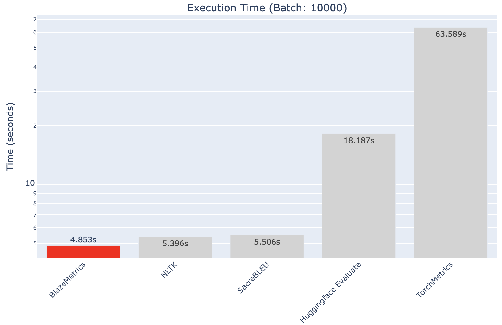

# BlazeMetrics

<p align="center">
  <a href="https://2796gaurav.github.io/blazemetrics/">
    
  </a>
</p>

<p align="center" style="font-size:1.5em;">
  <b>100x Faster LLM Evaluation</b>
</p>
<p align="center" style="font-size:1.1em;">
  Rust-powered evaluation suite processing <b>1M+ evaluations/sec</b>.<br>
  Complete LLM quality, safety, and performance monitoring in one unified API.
</p>

<div align="center">
  <a href="https://2796gaurav.github.io/blazemetrics/">
    
  </a>
</div>

<p align="center">
  <a href="https://pypi.org/project/blazemetrics/"></a>
  <a href="https://pepy.tech/project/blazemetrics"></a>
  <a href="https://pypi.org/project/blazemetrics/"></a>
  <a href="https://2796gaurav.github.io/blazemetrics/docs"></a>
  <a href="https://github.com/2796gaurav/blazemetrics/commits/main"></a>
  <a href="LICENSE"></a>
  <a href="https://pypi.org/project/blazemetrics/"></a>
  
</p>

---

## 🚦 Don't stop until done

BlazeMetrics is designed to make evaluation, guardrails, monitoring, and analytics continuous and actionable at production scale. Whether you're running compliance, safety, real-world production, or benchmarking workflows, BlazeMetrics is built to keep evaluating, analyzing, and monitoring—all the way to the finish line. No matter how large your data or how demanding your workflow, you get complete, automated, and live insights. <b>Don't stop until you're done.</b>

---

## Why BlazeMetrics?

- **All-in-one evaluation:** BLEU, ROUGE, WER, METEOR, and more—plus analytics and real guardrail safety.
- **Rust-powered:** 100x speed, process millions of LLM/NLP samples in seconds.
- **Guardrails built-in:** Blocklists, PII, regex, JSON schema, safety, and LLM-based factuality scoring.
- **Enterprise & research ready:** Analytics, anomaly detection, dashboards, monitoring, instant reporting.
- **Out-of-the-box for LLMs, RAG & agent workflows.**

---

## ⚡ Live Benchmark: Speed vs Leading Industry Libraries

See full details in the [Benchmarks section](https://2796gaurav.github.io/blazemetrics/benchmarks).

**Benchmark Objective:** Speed and RAM comparison computing BLEU, ROUGE, METEOR, etc. between BlazeMetrics, Huggingface Evaluate, SacreBLEU, NLTK, and TorchMetrics.

| Library                 | Time (s)   | Relative Speed |
|------------------------|------------|:--------------|
| **BlazeMetrics**       | 4.85 (ref) | 1.00x          |
| NLTK                   | 5.40       | 1.11x          |
| SacreBLEU              | 5.51       | 1.13x          |
| Huggingface Evaluate   | 18.19      | 3.75x          |
| TorchMetrics           | 63.59      | 13.10x         |

---

## Features At a Glance

-  **State-of-the-art metrics** (BLEU, ROUGE, WER, METEOR, CHRF, BERTScore & more)
- ️ **Guardrails**: Block unsafe content, redact PII, enforce custom policies with regex/JSON
-  **Streaming analytics**: Outlier detection, trending, alerts for real-time eval
-  **LLM & RAG integration**: Plug and play with OpenAI, Anthropic, LangChain, HuggingFace, code/agent ground truth, RAG
-  **Factuality/Judge**: Hallucination & faithfulness scoring using [LLM usage](https://2796gaurav.github.io/blazemetrics/llm-usage)
-  **Production-scale speed**: Rust core, easy parallelism and batch
-  **Dashboards & reporting**: Instant model/data card, web dashboards (optional)
-  **Easy to extend**: Custom guardrails, exporters, analytics for your workflow

---

## Installation

```shell
pip install blazemetrics
```

---

## Quickstart: Get Bleeding-Edge Metrics in Seconds

[See Learning Paths for guided examples →](https://2796gaurav.github.io/blazemetrics/learning-paths)

```python
from blazemetrics import BlazeMetricsClient

candidates = ["The quick brown fox.", "Hello world!"]
references = [["The fast brown fox."], ["Hello world."]]

client = BlazeMetricsClient()
metrics = client.compute_metrics(candidates, references)
print(metrics)
```

---

## Full LLM Workflow

Complete examples are available in the [LLM Usage section](https://2796gaurav.github.io/blazemetrics/llm-usage).

---

## Easy Integration

Real-world integrations and scenarios are covered in the [Use Cases section](https://2796gaurav.github.io/blazemetrics/use-cases).

---

## Dashboards & Reporting

- **Web dashboards:** Instantly launch a web app for monitoring and reporting  
- **Export:** Write HTML, CSV, Prometheus format, or push to cloud  

See [Documentation](https://2796gaurav.github.io/blazemetrics/docs).

---

## 📚 Learn More

- 🌐 [Homepage](https://2796gaurav.github.io/blazemetrics/)  
- 📖 [Documentation](https://2796gaurav.github.io/blazemetrics/docs)  
- 📊 [Benchmarks](https://2796gaurav.github.io/blazemetrics/benchmarks)  
- 🧩 [Real World Use Cases](https://2796gaurav.github.io/blazemetrics/use-cases)  
- 🤖 [LLM Usage](https://2796gaurav.github.io/blazemetrics/llm-usage)  
- 🎓 [Learning Paths](https://2796gaurav.github.io/blazemetrics/learning-paths)

---

## Contribute & Community

- Star us on [GitHub](https://github.com/2796gaurav/blazemetrics)  
- Open issues/feature requests, or create a PR!

---

## License

MIT

---

BlazeMetrics © 2025 [Gaurav](mailto:2796gaurav@gmail.com)
