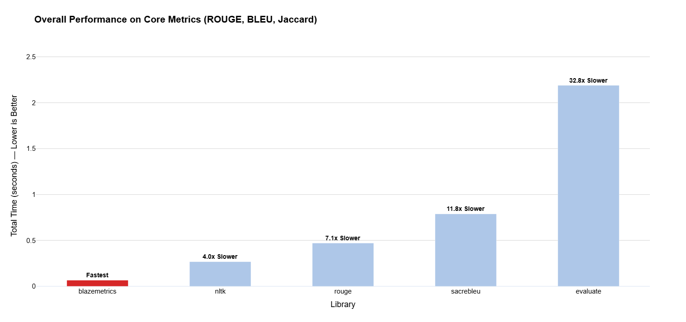

<div align="center">
  
  <h1>BlazeMetrics 🔥</h1>
  <p><strong>Ultra-fast NLP evaluation metrics powered by Rust</strong></p>
</div>

[](https://pypi.org/project/blazemetrics/)
[](https://pypi.org/project/blazemetrics/)
[](https://opensource.org/licenses/MIT)
[](https://pypi.org/project/blazemetrics/#files)
[](https://colab.research.google.com/drive/1No3vlPCIuZuAJfpK09xbaDyuveJ2LKfs?usp=sharing)

## 🚀 Performance Benchmark

<div align="center">
  
  <p><em>BlazeMetrics is up to <strong>32.8x faster</strong> than popular Python implementations</em></p>
</div>

## 🚀 Quick Start

**BlazeMetrics** is the fastest implementation of NLP evaluation metrics, powered by a highly optimized Rust core. Get up to **32.8x speedup** over pure Python implementations.

### Installation
```bash
pip install blazemetrics
```

### Your First Metrics
```python
from blazemetrics import rouge_score, bleu, chrf_score

# Sample data
candidates = ["the cat sat on the mat", "the dog ate the homework"]
references = [["the cat was on the mat"], ["the dog did my homework"]]

# ROUGE scores
rouge_1 = rouge_score(candidates, references, score_type="rouge_n", n=1)
rouge_2 = rouge_score(candidates, references, score_type="rouge_n", n=2)
rouge_l = rouge_score(candidates, references, score_type="rouge_l")

# BLEU score
bleu_scores = bleu(candidates, references)

# chrF score
chrf_scores = chrf_score(candidates, references, max_n=6, beta=2.0)

print(f"ROUGE-1: {rouge_1}")
print(f"BLEU: {bleu_scores}")
print(f"chrF: {chrf_scores}")
```

### Your First Guardrails
```python
from blazemetrics import Guardrails

# Create guardrails for content moderation
gr = Guardrails(
    blocklist=["bomb", "terror", "hate"],
    redact_pii=True,  # Auto-redact emails, phones, SSNs
    safety=True,      # Lightweight safety scoring
    case_insensitive=True
)

texts = [
    "My email is alice@example.com and SSN is 123-45-6789",
    "I will bomb the building",
    "Hello, how are you today?"
]

results = gr.check(texts)
print(results)
```

## 📚 Interactive Tutorials

Jump right into our comprehensive tutorials:

- **[01 - Installation & Setup](https://colab.research.google.com/drive/1No3vlPCIuZuAJfpK09xbaDyuveJ2LKfs?usp=sharing)** - Get started in minutes
- **[02 - Core Metrics Showcase](https://colab.research.google.com/drive/1gABpSf0rWjFSjJdMyYqXgbHOGhA4FyFI?usp=sharing)** - ROUGE, BLEU, chrF, METEOR, WER
- **[03 - Guardrails Showcase](https://colab.research.google.com/drive/19ZpqxQl7yvvxSd7FsnB603IbwOdx5NoT?usp=sharing)** - Content moderation & safety
- **[04 - Streaming Monitoring](https://colab.research.google.com/drive/17Mzd2p1oUfw0hjIHGw-E6jL5V3XITdhX?usp=sharing)** - Real-time monitoring
- **[05 - Production Workflows](https://colab.research.google.com/drive/1Vi86d3WPtG9p3V2RmxSHWt4wXxJ049Qe?usp=sharing)** - Batch processing & deployment

## ✨ Key Features

### 🚀 **Blazing Performance**
- **Rust Core**: Native performance without Python GIL limitations
- **Parallel Processing**: Automatic multi-core acceleration with Rayon
- **NumPy Integration**: Efficient handling of embeddings and numerical data
- **32.8x Faster**: Up to 32.8x speedup over pure Python implementations

### 📊 **Comprehensive Metrics**
- **ROUGE**: ROUGE-1, ROUGE-2, ROUGE-L for text summarization
- **BLEU**: Bilingual Evaluation Understudy for machine translation
- **chrF**: Character n-gram F-score for multilingual evaluation
- **METEOR**: Metric for Evaluation of Translation with Explicit ORdering
- **WER**: Word Error Rate for speech recognition
- **Token-level**: F1, Jaccard similarity for fine-grained analysis
- **BERTScore**: Semantic similarity using contextual embeddings
- **MoverScore**: Word mover distance for semantic evaluation

### 🛡️ **LLM Guardrails**
- **Blocklist Matching**: Fast keyword filtering via Aho-Corasick algorithm
- **Regex Policies**: Precompiled DFA for efficient pattern matching
- **PII Redaction**: Automatic detection and redaction of sensitive data
- **Safety Scoring**: Lightweight heuristic-based safety assessment
- **JSON Schema Validation**: Schema compliance with auto-repair
- **Injection Detection**: Prompt injection and jailbreak attempt detection
- **Unicode Spoofing**: Detection of malicious Unicode manipulation
- **Streaming Enforcement**: Real-time content moderation

### 🔄 **Production Ready**
- **Batch Processing**: Optimized for large-scale evaluation
- **Streaming Support**: Token-level monitoring for live applications
- **Monitoring**: Rolling windows, alerts, and metrics aggregation
- **Exporters**: CSV, JSON, and custom metric export formats

## 🎯 Use Cases

### **Research & Development**
```python
# Fast evaluation for model development
from blazemetrics import compute_text_metrics

metrics = compute_text_metrics(
    candidates=model_outputs,
    references=ground_truth,
    metrics=["rouge_n", "bleu", "chrf"],
    n_values=[1, 2],  # ROUGE-1, ROUGE-2
    max_n=4,          # BLEU n-grams
    beta=2.0          # chrF beta
)
```

### **Content Moderation**
```python
# Real-time content filtering
from blazemetrics import monitor_tokens_sync

def token_stream():
    # Your token generator
    yield "Hello"
    yield " world"
    yield "!"

# Monitor tokens as they stream
for alert in monitor_tokens_sync(token_stream(), guardrails, every_n_tokens=10):
    if alert:
        print(f"Content flagged: {alert}")
```

### **Production Monitoring**
```python
# Live monitoring with rolling windows
from blazemetrics import monitor_stream_sync

# Monitor a stream of model outputs
for metrics in monitor_stream_sync(
    model_outputs, 
    window_size=100,
    metrics=["rouge_1", "bleu", "wer"]
):
    if metrics["rouge_1"] < 0.3:
        print("Quality alert: ROUGE-1 below threshold")
```

## ⚙️ Performance Tuning

Control parallelism for your use case:

```python
from blazemetrics import set_parallel, set_parallel_threshold

# For small batches (streaming)
set_parallel_threshold(1000)  # Only parallelize batches >= 1000

# For large batch processing
set_parallel(True)  # Enable full parallelism
```

## 📦 Installation Options

### **End Users** (Recommended)
```bash
pip install blazemetrics
```
Prebuilt wheels available for Linux, macOS, and Windows (Python 3.8-3.12).

### **Wheel-Only Install** (Avoid compilation)
```bash
pip install --only-binary :all: blazemetrics
```

### **Developers** (From source)
```bash
# Install Rust toolchain
curl --proto '=https' --tlsv1.2 -sSf https://rustup.rs | sh

# Install from source
pip install -r requirements-dev.txt
pip install -e .
```

## 🔧 Examples

### **Basic Metrics**
```bash
python examples/basic_usage.py
```

### **Guardrails**
```bash
python examples/guardrails.py
```

### **Streaming with OpenAI**
```bash
python examples/openai_stream_guardrails.py
```

### **Streaming with Claude**
```bash
python examples/claude_stream_guardrails.py
```

### **Batch Workflow**
```bash
python examples/batch_workflow.py
```

### **Live Monitoring**
```bash
python examples/live_monitoring.py
```

## 🤝 Contributing

We welcome contributions! See our [Contributing Guide](CONTRIBUTING.md) for details.

### **Adding New Metrics**
1. Implement logic in Rust under `src/`
2. Use Rayon for parallel batch processing
3. Expose as `#[pyfunction]` in `src/lib.rs`
4. Rebuild: `pip install -e .`

### **Development Setup**
```bash
# Install Rust toolchain
curl --proto '=https' --tlsv1.2 -sSf https://rustup.rs | sh

# Clone and setup
git clone https://github.com/2796gaurav/blazemetrics.git
cd blazemetrics
pip install -r requirements-dev.txt
pip install -e .
```

## 📄 License

This project is licensed under the MIT License - see the [LICENSE](LICENSE) file for details.

## 🔗 Links

- **Documentation**: [GitHub Wiki](https://github.com/2796gaurav/blazemetrics/wiki)
- **Issues**: [GitHub Issues](https://github.com/2796gaurav/blazemetrics/issues)
- **Discussions**: [GitHub Discussions](https://github.com/2796gaurav/blazemetrics/discussions)

---

<div align="center">
  <p>Made with ❤️ by the BlazeMetrics team</p>
  <p><em>Accelerating NLP evaluation with Rust-powered performance</em></p>
</div>
